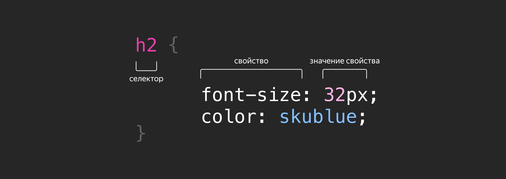

# Знакомство с CSS
___________________________________________________
## Лабораторная работа №4
В данной работе вы познакомитесь с вёрсткой страниц, HTML и стилями.
___________________________________________________
**Внимание, Attention, Danger**
В этой работе вам понадобиться набор файлов из solution 3 ей работы. Так что если вы её не сделали (LOL) пора бы этим заняться.

### Краткое описание
В третьей работы вы уже настраивали стили для различных элементов, такая настройка, когда стиль прописывается атрибутом тега, называется **инлайн**.  
Инлайн стиль идеально подходит для одиночного уникального элемента, однако в случае если таковых элементов +100500 тысяч штук (к примеру 100 абзацев текста) то это решение уже не выглядит столь уж хорошим.

И вот тут на сцену выходят правила стиля CSS. В роли селектора выступает атрибут тега.

**Основные моменты**
- После селектора в фигурных скобках указывают свойства стилей.
- Фигурные скобки вмещают сколько угодно пар **свойство-значение**.
- Каждую новую пару принято писать на следующей строке, а в конце — ставить точку с запятой.
- **Селектор** — не обязательно и далеко не всегда имя тега.

#### Куда ставить то
И так как писать стили в оооообщих чертах понятно, куда их пихать.
Первый вариант, не совсем хороший - прямо в HTML. Можно разместить весь код в <head> и обернуть парынм тегом <style>.
Второй вариант (светлая сторона силы) - перенести всё в файл CSS.
**Мы опробуем оба варианта**
___________________________________________________
#### 1. ЭЭЭЭксперименты
1. Добавьте парные теги `<style>` в `head` **html** файла после всех остальных ссылок и разместите там правила стиля для заголовка `h1`, а из самого заголовка всё удалите.
2. Проделайте ту же операцию с заголовками второго уровня.
3. Отлично, правда html потихоньку превращается в чудовище Франкенштейна. Давайте создадим отдельный файл **style.css** и перенсём туда всё из тега **<style>**. Сам тег и его содержимое можно удалить из html.
4. А теперь давайте подключим стили! Добавьте ссылку на файл со стилями в head вашего html
```html
<head>
  <!-- здесь что-то про кодировку, заголовок, фавиконку -->
  <link rel="stylesheet" href="style.css">
</head> 
```
5. Добавьте свойство для `body` сделайте минимальную ширину равной 850 пикселей
6. Доведём дело до конца на нашем пути разделения ответственности. Создайте правило для тега img и перенесите туда свойство тега img c шириной в 210 пикселей.
7. Немного самостоятельности вам в карму. Добавьте нужные нам шрифты: заголовки первого уровня - `William, serif`, заголовки второго уровня и абзацы - `Inter, sans-serif`
Если всё выглядит также как было, то вы молодец, теперь все стили находятся в отдельном файле.
